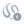
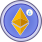
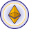
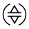

# @api3/logos

## 0.2.24

### Patch Changes

- 5b3d40a: Some changes have been made to the `logos`.

    | Logo                                                          | Name      | Category |
    | ------------------------------------------------------------- | --------- | -------- |
    |        | 146       | chain    |
    |  | 146-light | chain    |
    
## 0.2.23

### Patch Changes

- f99e65c: Some changes have been made to the `logos`.

    | Logo                                                 | Name | Category |
    | ---------------------------------------------------- | ---- | -------- |
    |  | lbtc | symbol   |

## 0.2.22

### Patch Changes

- 37ed525: Following logos has been updated:

    | Logo                                                      | Name  | Category |
    | --------------------------------------------------------- | ----- | -------- |
    |  | 57054 | chain    |

## 0.2.21

### Patch Changes

- 541d457: Some changes have been made to the `logos`.

    | Logo                                                            | Name        | Category |
    | --------------------------------------------------------------- | ----------- | -------- |
    |  | 57054-light | chain    |
    |        | 57054       | chain    |

## 0.2.20

### Patch Changes

- 11facc9: Some changes have been made to the `logos`.

    | Logo                                                | Name | Category |
    | --------------------------------------------------- | ---- | -------- |
    |  | zrc  | symbol   |

## 0.2.19

### Patch Changes

- ba689bd: Some changes have been made to the `logos`.

    | Logo                                                    | Name    | Category |
    | ------------------------------------------------------- | ------- | -------- |
    |   | morpho  | symbol   |
    |     | yusd    | symbol   |
    |  | solvbtc | symbol   |

## 0.2.18

### Patch Changes

- 5ae06eb: Some changes have been made to the `logos`.

    | Logo                                                       | Name   | Category |
    | ---------------------------------------------------------- | ------ | -------- |
    |  | 763373 | chain    |

## 0.2.17

### Patch Changes

- 1ceb3c2: Following logos has been updated:

    | Logo                                                           | Name       | Category |
    | -------------------------------------------------------------- | ---------- | -------- |
    |      | 421614     | chain    |
    |     | 6038361    | chain    |
    |        | 2340       | chain    |
    |       | 43113      | chain    |
    |       | 84532      | chain    |
    |       | 80084      | chain    |
    |      | 200810     | chain    |
    |   | 168587773  | chain    |
    |      | 808813     | chain    |
    |          | 97         | chain    |
    |      | 325000     | chain    |
    |          | 71         | chain    |
    |        | 1115       | chain    |
    |       | 17000      | chain    |
    |    | 11155111   | chain    |
    |        | 4002       | chain    |
    |        | 2522       | chain    |
    |       | 10200      | chain    |
    |       | 13473      | chain    |
    |        | 2424       | chain    |
    |        | 2221       | chain    |
    |        | 2358       | chain    |
    |        | 1891       | chain    |
    |        | 4201       | chain    |
    |  | 1952959480 | chain    |
    |     | 3441006    | chain    |
    |      | 686868     | chain    |
    |       | 59902      | chain    |
    |         | 919        | chain    |
    |        | 1287       | chain    |
    |        | 5611       | chain    |
    |    | 11155420   | chain    |
    |       | 80002      | chain    |
    |  | 1918988905 | chain    |
    |      | 534351     | chain    |
    |        | 1328       | chain    |
    |        | 1946       | chain    |
    |       | 64165      | chain    |
    |      | 167009     | chain    |
    |         | 195        | chain    |
    |       | 48899      | chain    |

## 0.2.16

### Patch Changes

- a64c4ad: Some changes have been made to the `logos`.

    | Logo                                                          | Name      | Category |
    | ------------------------------------------------------------- | --------- | -------- |
    |        | 480       | chain    |
    |      | 33139     | chain    |
    |       | 4801      | chain    |
    |  | 480-light | chain    |
    |       | 2340      | chain    |

## 0.2.15

### Patch Changes

- 9d82f63: Following logos has been updated:

    | Logo                                                         | Name      | Category |
    | ------------------------------------------------------------ | --------- | -------- |
    |     | 33111     | chain    |
    |         | 1         | chain    |
    |  | 11155111  | chain    |
    |     | 59141     | chain    |
    |      | 5003      | chain    |
    |      | 1750      | chain    |
    |      | 1088      | chain    |
    |     | 59902     | chain    |
    |        | 10        | chain    |
    |       | 137       | chain    |
    |     | 80002     | chain    |
    |      | 1101      | chain    |
    |      | 2442      | chain    |
    |         | pxeth     | symbol   |
    |     | ultraeths | symbol   |
    |        | wsteth    | symbol   |

## 0.2.14

### Patch Changes

- cfd8205: Some changes have been made to the `logos`.

    | Logo                                                          | Name    | Category     |
    | ------------------------------------------------------------- | ------- | ------------ |
    |  | alchemy | api-provider |

## 0.2.13

### Patch Changes

- 40d8098: Some changes have been made to the `logos`.

    | Logo                                                  | Name  | Category |
    | ----------------------------------------------------- | ----- | -------- |
    |  | brett | symbol   |
    |  | cbbtc | symbol   |

## 0.2.12

### Patch Changes

- 0cdd0ce: Some changes have been made to the `logos`.

    | Logo                                                                | Name          | Category     |
    | ------------------------------------------------------------------- | ------------- | ------------ |
    |  | shift-markets | api-provider |
    |                 | cook          | symbol       |

## 0.2.11

### Patch Changes

- 1f8b0ec: Some changes have been made to the `logos`.

    | Logo                                                | Name | Category |
    | --------------------------------------------------- | ---- | -------- |
    |  | scr  | symbol   |

## 0.2.10

### Patch Changes

- c6303a0: Some changes have been made to the `logos`.

    | Logo                                                   | Name   | Category |
    | ------------------------------------------------------ | ------ | -------- |
    |  | msteth | symbol   |
    |   | egeth  | symbol   |

## 0.2.9

### Patch Changes

- 9128d06: Some changes have been made to the `logos`.

    | Logo                                                 | Name | Category |
    | ---------------------------------------------------- | ---- | -------- |
    |  | tusd | symbol   |

## 0.2.8

### Patch Changes

- bd8c1d5: Some changes have been made to the `logos`.

    | Logo                                                      | Name      | Category |
    | --------------------------------------------------------- | --------- | -------- |
    |      | lseth     | symbol   |
    |  | insfrxeth | symbol   |
    |      | lumia     | symbol   |
    |      | cmeth     | symbol   |

## 0.2.7

### Patch Changes

- 254d34e: Some changes have been made to the `logos`.

    | Logo                                                       | Name   | Category |
    | ---------------------------------------------------------- | ------ | -------- |
    |  | 911867 | chain    |

## 0.2.6

### Patch Changes

- cec6f5b: Some changes have been made to the `logos`.

    | Logo                                                     | Name | Category |
    | -------------------------------------------------------- | ---- | -------- |
    |  | 1301 | chain    |

## 0.2.5

### Patch Changes

- 91c94ca: Some changes have been made to the `logos`.

    | Logo                                                 | Name | Category |
    | ---------------------------------------------------- | ---- | -------- |
    |  | fbtc | symbol   |

## 0.2.4

### Patch Changes

- 11aaa98: Some changes have been made to the `logos`.

    | Logo                                                 | Name | Category |
    | ---------------------------------------------------- | ---- | -------- |
    |  | ausd | symbol   |
    |  | ebtc | symbol   |

## 0.2.3

### Patch Changes

- 7f4a1aa: Some changes have been made to the `logos`.

    | Logo                                                 | Name | Category |
    | ---------------------------------------------------- | ---- | -------- |
    |  | eurc | symbol   |

## 0.2.2

### Patch Changes

- ff453e3: Some changes have been made to the `logos`.

    | Logo                                                    | Name    | Category |
    | ------------------------------------------------------- | ------- | -------- |
    |  | insteth | symbol   |

## 0.2.1

### Patch Changes

- 2c124a9: Remove unused svg files

## 0.2.0

### Minor Changes

- 3a08da1: Support for a specified chain, symbol, or api-provider is now limited to following stages:
    - surveying
    - active
    - deprecated

## 0.1.58

### Patch Changes

- 5c9988c: Some changes have been made to the `logos`.

    | Logo                                                            | Name      | Category     |
    | --------------------------------------------------------------- | --------- | ------------ |
    |  | blocksize | api-provider |

## 0.1.57

### Patch Changes

- 5368de1: Some changes have been made to the `logos`.

    | Logo                                                | Name | Category |
    | --------------------------------------------------- | ---- | -------- |
    |  | zro  | symbol   |
    |   | zk   | symbol   |

## 0.1.56

### Patch Changes

- f5dfeed: Add RENDER symbol

    | Logo                                                   | Name   | Category |
    | ------------------------------------------------------ | ------ | -------- |
    |  | render | symbol   |

## 0.1.55

### Patch Changes

- 4d8e518: Some changes have been made to the `logos`.

    | Logo                                                | Name | Category |
    | --------------------------------------------------- | ---- | -------- |
    |  | pol  | symbol   |

## 0.1.54

### Patch Changes

- a6f433e: Some changes have been made to the `logos`.

    | Logo                                                     | Name | Category |
    | -------------------------------------------------------- | ---- | -------- |
    |  | 1946 | chain    |

## 0.1.53

### Patch Changes

- d35ff66: Some changes have been made to the `logos`.

    | Logo                                                               | Name         | Category     |
    | ------------------------------------------------------------------ | ------------ | ------------ |
    |  | coin-metrics | api-provider |
    |     | blast api    | api-provider |
    |          | drpc         | api-provider |

## 0.1.52

### Patch Changes

- 9bb574c: Some changes have been made to the `logos`.

    | Logo                                                            | Name        | Category |
    | --------------------------------------------------------------- | ----------- | -------- |
    |        | 64165       | chain    |
    |  | 64165-light | chain    |

## 0.1.51

### Patch Changes

- 1f78d97: Some changes have been made to the `logos`.

    | Logo                                                  | Name  | Category |
    | ----------------------------------------------------- | ----- | -------- |
    |  | ageth | symbol   |

## 0.1.50

### Patch Changes

- 621b739: Some changes have been made to the `logos`.

    | Logo                                                                | Name            | Category |
    | ------------------------------------------------------------------- | --------------- | -------- |
    |  | 994873017-light | chain    |
    |            | ultraETHs       | symbol   |
    |       | 1952959480      | chain    |
    |        | 994873017       | chain    |

## 0.1.49

### Patch Changes

- 2336a4b: Some changes have been made to the `logos`.

    | Logo                                                       | Name   | Category |
    | ---------------------------------------------------------- | ------ | -------- |
    |  | 808813 | chain    |

## 0.1.48

### Patch Changes

- e284a9e: Some changes have been made to the `logos`.

    | Logo                                                       | Name | Category     |
    | ---------------------------------------------------------- | ---- | ------------ |
    |  | ankr | api-provider |

## 0.1.47

### Patch Changes

- a42c39c: Some changes have been made to the `logos`.

    | Logo                                                    | Name    | Category |
    | ------------------------------------------------------- | ------- | -------- |
    |  | ankreth | symbol   |

## 0.1.46

### Patch Changes

- 1c35aa4: Some changes have been made to the `logos`.

    | Logo                                                | Name | Category |
    | --------------------------------------------------- | ---- | -------- |
    |  | cfx  | symbol   |

## 0.1.45

### Patch Changes

- 6979ada: Some changes have been made to the `logos`.

    | Logo                                                         | Name     | Category |
    | ------------------------------------------------------------ | -------- | -------- |
    |  | 71-light | chain    |
    |      | 1030     | chain    |
    |        | 71       | chain    |

## 0.1.44

### Patch Changes

- 9d2935c: Some changes have been made to the `logos`.

    | Logo                                                        | Name    | Category |
    | ----------------------------------------------------------- | ------- | -------- |
    |      | 169     | chain    |
    |  | 3441006 | chain    |

## 0.1.43

### Patch Changes

- 0cd02ac: Some changes have been made to the `logos`.

    | Logo                                                           | Name       | Category |
    | -------------------------------------------------------------- | ---------- | -------- |
    |  | 1030-light | chain    |

## 0.1.42

### Patch Changes

- eab2525: Some changes have been made to the `logos`.

    | Logo                                                  | Name  | Category |
    | ----------------------------------------------------- | ----- | -------- |
    |  | ineth | symbol   |

## 0.1.41

### Patch Changes

- 5541c17: Some changes have been made to the `logos`.

    | Logo                                                           | Name       | Category |
    | -------------------------------------------------------------- | ---------- | -------- |
    |  | 4913-light | chain    |
    |        | 4913       | chain    |

## 0.1.40

### Patch Changes

- ea5a3de: Some changes have been made to the `logos`.

    | Logo                                                      | Name  | Category |
    | --------------------------------------------------------- | ----- | -------- |
    |  | 48900 | chain    |

## 0.1.39

### Patch Changes

- 529b222: Some changes have been made to the `logos`.

    | Logo                                                      | Name  | Category |
    | --------------------------------------------------------- | ----- | -------- |
    |  | 80084 | chain    |

## 0.1.38

### Patch Changes

- 85c2c52: Some changes have been made to the `logos`.

    | Logo                                                  | Name  | Category |
    | ----------------------------------------------------- | ----- | -------- |
    |  | blast | symbol   |

## 0.1.37

### Patch Changes

- f57f25a: Some changes have been made to the `logos`.

    | Logo                                                   | Name   | Category |
    | ------------------------------------------------------ | ------ | -------- |
    |  | weeths | symbol   |

## 0.1.36

### Patch Changes

- 8716d45: Some changes have been made to the `logos`.

    | Logo                                              | Name | Category |
    | ------------------------------------------------- | ---- | -------- |
    |  | w    | symbol   |

## 0.1.35

### Patch Changes

- 1728dea: Some changes have been made to the `logos`.

    | Logo                                                       | Name   | Category |
    | ---------------------------------------------------------- | ------ | -------- |
    |         | nke    | symbol   |
    |        | uber   | symbol   |
    |        | pypl   | symbol   |
    |         | wld    | symbol   |
    |         | wld    | symbol   |
    |        | uber   | symbol   |
    |         | nke    | symbol   |
    |        | baba   | symbol   |
    |  | 534352 | chain    |
    |         | woo    | symbol   |
    |  | 534352 | chain    |

## 0.1.34

### Patch Changes

- 9835ef9: Some changes have been made to the `logos`.

    | Logo                                                  | Name  | Category |
    | ----------------------------------------------------- | ----- | -------- |
    |  | taiko | symbol   |

## 0.1.33

### Patch Changes

- e7a6ee9: Some changes have been made to the `logos`.

    | Logo                                                       | Name   | Category |
    | ---------------------------------------------------------- | ------ | -------- |
    |        | safe   | symbol   |
    |       | ethfi  | symbol   |
    |  | 534351 | chain    |

## 0.1.32

### Patch Changes

- f6bae57: Some changes have been made to the `logos`.

    | Logo                                                       | Name   | Category |
    | ---------------------------------------------------------- | ------ | -------- |
    |  | 200901 | chain    |
    |  | 200810 | chain    |

## 0.1.31

### Patch Changes

- 74bf580: Some changes have been made to the `logos`.

    | Logo                                                       | Name       | Category |
    | ---------------------------------------------------------- | ---------- | -------- |
    |       | wbeth      | symbol   |
    |        | bnbx       | symbol   |
    |     | slisbnb    | symbol   |
    |  | bnbx-light | symbol   |

## 0.1.30

### Patch Changes

- ea2c27d: Some changes have been made to the `logos`.

    | Logo                                                       | Name   | Category |
    | ---------------------------------------------------------- | ------ | -------- |
    |   | 42161  | chain    |
    |  | 421614 | chain    |

## 0.1.29

### Patch Changes

- 4e894f8: Some changes have been made to the `logos`.

    | Logo                                                     | Name | Category |
    | -------------------------------------------------------- | ---- | -------- |
    |  | 1750 | chain    |

## 0.1.28

### Patch Changes

- 563b8ed: Some changes have been made to the `logos`.

    | Logo                                                  | Name  | Category |
    | ----------------------------------------------------- | ----- | -------- |
    |  | degen | symbol   |
    |    | ena   | symbol   |
    |  | fdusd | symbol   |
    |   | core  | symbol   |

## 0.1.27

### Patch Changes

- e111fc7: Some changes have been made to the `logos`.

    | Logo                                                 | Name | Category |
    | ---------------------------------------------------- | ---- | -------- |
    |  | mode | symbol   |
    |   | inj  | symbol   |
    |  | rari | symbol   |
    |  | neon | symbol   |

## 0.1.26

### Patch Changes

- 97140e9: Some changes have been made to the `logos`.

    | Logo                                                       | Name   | Category |
    | ---------------------------------------------------------- | ------ | -------- |
    |  | 167000 | chain    |
    |    | 1329   | chain    |

## 0.1.25

### Patch Changes

- b305a8c: Some changes have been made to the `logos`.

    | Logo                                                           | Name       | Category |
    | -------------------------------------------------------------- | ---------- | -------- |
    |          | 82         | chain    |
    |  | 1918988905 | chain    |
    |    | 82-light   | chain    |
    |        | 1115       | chain    |
    |          | 83         | chain    |

## 0.1.24

### Patch Changes

- 505d2db: Some changes have been made to the `logos`.

    | Logo                                                  | Name  | Category |
    | ----------------------------------------------------- | ----- | -------- |
    |  | speth | symbol   |

## 0.1.23

### Patch Changes

- f50a0b3: Some changes have been made to the `logos`.

    | Logo                                                        | Name    | Category |
    | ----------------------------------------------------------- | ------- | -------- |
    |     | 3776    | chain    |
    |  | 6038361 | chain    |
    |    | 13473   | chain    |

## 0.1.22

### Patch Changes

- 15a263c: Some changes have been made to the `logos`.

    | Logo                                                     | Name | Category |
    | -------------------------------------------------------- | ---- | -------- |
    |  | 1798 | chain    |
    |       | chz  | symbol   |

## 0.1.21

### Patch Changes

- 14dada6: Some changes have been made to the `logos`.

    | Logo                                                     | Name | Category |
    | -------------------------------------------------------- | ---- | -------- |
    |  | 2424 | chain    |
    |  | 2525 | chain    |

- e2bcb3a: Add OEV Network logo Update inEVM and inEVM testnet logos

## 0.1.20

### Patch Changes

- 4cd762f: Some changes have been made to the `logos`.

    | Logo                                                     | Name | Category |
    | -------------------------------------------------------- | ---- | -------- |
    |  | 1116 | chain    |

## 0.1.19

### Patch Changes

- b1c8275: Some changes have been made to the `logos`.

    | Logo                                                 | Name | Category |
    | ---------------------------------------------------- | ---- | -------- |
    |  | ordi | symbol   |
    |  | sats | symbol   |

## 0.1.18

### Patch Changes

- 9236566: Some changes have been made to the `logos`.

    | Logo                                                           | Name       | Category |
    | -------------------------------------------------------------- | ---------- | -------- |
    |  | 1380012617 | chain    |
    |         | 255        | chain    |
    |            | merl       | symbol   |
    |       | 80085      | chain    |
    |        | 2358       | chain    |
    |         | 223        | chain    |
    |        | 1123       | chain    |
    |      | 713715     | chain    |
    |           | sfrax      | symbol   |

## 0.1.17

### Patch Changes

- e6b1d8d: Some changes have been made to the `logos`.

    | Logo                                                            | Name        | Category |
    | --------------------------------------------------------------- | ----------- | -------- |
    |  | 81457-light | chain    |

## 0.1.16

### Patch Changes

- 9a4cefd: Some changes have been made to the `logos`.

    | Logo                                                            | Name        | Category |
    | --------------------------------------------------------------- | ----------- | -------- |
    |  | 60808-light | chain    |
    |        | 60808       | chain    |

## 0.1.15

### Patch Changes

- 0c06bae: Some changes have been made to the `logos`.

    | Logo                                                     | Name | Category |
    | -------------------------------------------------------- | ---- | -------- |
    |  | 4201 | chain    |
    |    | 42   | chain    |

## 0.1.14

### Patch Changes

- 49a72dd: Add missing logos

    - inEVM
    - inEVM testnet
    - Merlin
    - Merlin testnet
    - Taiko Hekla testnet

## 0.1.13

### Patch Changes

- f71592c: Some changes have been made to the `logos`.

    | Logo                                                      | Name  | Category |
    | --------------------------------------------------------- | ----- | -------- |
    |  | 17000 | chain    |

## 0.1.12

### Patch Changes

- 85a1592: Some changes have been made to the `logos`.

    | Logo                                                      | Name  | Category |
    | --------------------------------------------------------- | ----- | -------- |
    |  | 80002 | chain    |

## 0.1.11

### Patch Changes

- 8f98a89: Some changes have been made to the `logos`.

    | Logo                                                          | Name      | Category |
    | ------------------------------------------------------------- | --------- | -------- |
    |       | 1891      | chain    |
    |  | 245022934 | chain    |
    |  | 245022926 | chain    |
    |        | 111       | chain    |

## 0.1.10

### Patch Changes

- 8a2e358: Some changes have been made to the `logos`.

    | Logo                                                  | Name  | Category |
    | ----------------------------------------------------- | ----- | -------- |
    |    | tao   | symbol   |
    |    | ern   | symbol   |
    |   | aero  | symbol   |
    |  | juice | symbol   |
    |  | sttao | symbol   |

## 0.1.9

### Patch Changes

- bfd976e: Some changes have been made to the `logos`.

    | Logo                                                      | Name  | Category |
    | --------------------------------------------------------- | ----- | -------- |
    |    | 204   | chain    |
    |   | 5611  | chain    |
    |  | 48899 | chain    |
    |   | 1890  | chain    |

## 0.1.8

### Patch Changes

- 88b3789: Some changes have been made to the `logos`.

    | Logo                                                       | Name   | Category |
    | ---------------------------------------------------------- | ------ | -------- |
    |   | 42161  | chain    |
    |         | dfi    | symbol   |
    |       | neutr  | symbol   |
    |  | 421613 | chain    |
    |   | 42170  | chain    |

## 0.1.7

### Patch Changes

- ab0af3d: Some changes have been made to the `logos`.

    | Logo                                                            | Name        | Category |
    | --------------------------------------------------------------- | ----------- | -------- |
    |          | 919         | chain    |
    |          | 196         | chain    |
    |  | 34443-light | chain    |
    |    | 252-light   | chain    |
    |    | 196-light   | chain    |
    |        | 34443       | chain    |
    |          | 252         | chain    |
    |         | 2522        | chain    |
    |          | 195         | chain    |

## 0.1.6

### Patch Changes

- 1097190: Some changes have been made to the `logos`.

    | Logo                                                  | Name  | Category |
    | ----------------------------------------------------- | ----- | -------- |
    |    | axl   | symbol   |
    |     | ar    | symbol   |
    |   | strk  | symbol   |
    |  | manta | symbol   |
    |    | ron   | symbol   |

## 0.1.5

### Patch Changes

- 4de62e0: Some changes have been made to the `logos`.

    | Logo                                                  | Name  | Category |
    | ----------------------------------------------------- | ----- | -------- |
    |  | susde | symbol   |

## 0.1.4

### Patch Changes

- 95ef951: Some changes have been made to the `logos`.

    | Logo                                                 | Name | Category |
    | ---------------------------------------------------- | ---- | -------- |
    |   | sei  | symbol   |
    |  | ondo | symbol   |

## 0.1.3

### Patch Changes

- f98daf5: Adds Linea Sepolia Testnet logo

## 0.1.2

### Patch Changes

- 896b2be: Some changes have been made to the `logos`.

    | Logo | Name | Category |
    | ---- | ---- | -------- |

## 0.1.1

### Patch Changes

- e6eadb0: Publish using changeset

## 2.11.1

### Patch Changes

- 0526662: Some changes have been made to the `logos`.

    | Logo                                                   | Name   | Category |
    | ------------------------------------------------------ | ------ | -------- |
    |  | pendle | symbol   |
    |   | mpeth  | symbol   |
    |    | usdb   | symbol   |

## 2.11.0

### Minor Changes

- 70f88e8: Missing sepolia testnet logos added

## 2.10.2

### Patch Changes

- 401566b: Some changes have been made to the `logos`.

    | Logo                                                              | Name        | Category     |
    | ----------------------------------------------------------------- | ----------- | ------------ |
    |   | tradermade  | api-provider |
    |            | 137         | chain        |
    |            | 599         | chain        |
    |       | dxfeed      | api-provider |
    |     | 2001-light  | chain        |
    |         | ncfx        | api-provider |
    |         | 534353      | chain        |
    |         | 200101      | chain        |
    |       | nodary      | api-provider |
    |        | kaiko       | api-provider |
    |       | finage      | api-provider |
    |      | finnhub     | api-provider |
    |    | iex-cloud   | api-provider |
    |           | 2001        | chain        |
    |          | 80001       | chain        |
    |  | coinpaprika | api-provider |
    |     | 2001-light  | chain        |
    |           | 1088        | chain        |
    |   | twelvedata  | api-provider |

## 2.10.1

### Patch Changes

- 944ac32: Some changes have been made to the `logos`.

    | Logo                                                           | Name       | Category |
    | -------------------------------------------------------------- | ---------- | -------- |
    |  | 2001-light | chain    |
    |  | 2001-light | chain    |

## 2.10.0

### Minor Changes

- d273851: Exchange Rate postfix is now ignored

## 2.9.5

### Patch Changes

- 3aba9f5: Some changes have been made to the `logos`.

    | Logo                                                  | Name  | Category |
    | ----------------------------------------------------- | ----- | -------- |
    |  | wusdm | symbol   |
    |  | ezeth | symbol   |
    |  | susde | symbol   |
    |   | sdai  | symbol   |
    |  | savax | symbol   |

## 2.9.4

### Patch Changes

- 62a1d48: Some changes have been made to the `logos`.

    | Logo                                                              | Name              | Category |
    | ----------------------------------------------------------------- | ----------------- | -------- |
    |              | rseth             | symbol   |
    |             | rsweth            | symbol   |
    |               | usdy              | symbol   |
    |                | dym               | symbol   |
    |  | pxethexchangerate | symbol   |
    |             | apxeth            | symbol   |

## 2.9.3

### Patch Changes

- c77672d: Some changes have been made to the `logos`.

    | Logo                                                          | Name      | Category |
    | ------------------------------------------------------------- | --------- | -------- |
    |      | 81457     | chain    |
    |  | 168587773 | chain    |

## 2.9.2

### Patch Changes

- 0beed88: Add provenance check

## 2.9.1

### Patch Changes

- 66f2d1d: Some changes have been made to the `logos`.

    | Logo                                                            | Name      | Category     |
    | --------------------------------------------------------------- | --------- | ------------ |
    |  | coingecko | api-provider |

## 2.9.0

### Minor Changes

- f1e0223: Light version support improved

## 2.8.5

### Patch Changes

- 8c45d99: # What's Changed Release created by the release script. Logos updated.

## 2.8.4

### Patch Changes

- fb4263a: # What's Changed Release created by the release script. Logos updated.

## 2.8.3

### Patch Changes

- e781776: # What's Changed Release created by the release script. Logos updated.

## 2.8.2

### Patch Changes

- 47337ac: Fixes optional parameter

## 2.8.1

### Patch Changes

- c69c97f: Fixed mEth logo

## 2.8.0

### Minor Changes

- 0ff4256: Light mode is implemented

## 2.7.0

### Minor Changes

- 2faedee: Logo designed synced with market

## 2.6.0

### Minor Changes

- c22c01f: Blast Sepolia Testnet added

## 2.5.0

### Minor Changes

- 1af67c6: New chain logos added;

    1. Lightlink (chain ID: 1890)
    2. LightLink Goerli Testnet (chain ID: 1891)

## 2.4.0

### Minor Changes

- b26653b: \`@nodary/utilities\` replaced with \`@phase21/api-integrations\`.

## 2.3.0

### Minor Changes

- e7ef4c3: New symbols are added.

    - `uniETH`
    - `osETH`
    - `weETH`
    - `PYUSD`
    - `WLD`

## 2.2.0

### Minor Changes

- a539166: Dependency update: `@phase21/chains`

## 2.1.0

### Minor Changes

- 6ccfa82: Update api-integrations to `@phase21/api-integrations`

## 2.0.0

### Major Changes

- f8cb93a: Package moved to phase21 organization

## 1.0.0

### Major Changes

- 3c328a1: Package name has been changed to `api3-logos` `api-integrations` package is updated

## 0.0.18

### Patch Changes

- c5d9628: - New logos added: ASTR, USDe, HG, INTC, DIS
    - Renovate config updated

## 0.0.17

### Patch Changes

- b6935b0: Dependency packages updated.

## 0.0.16

### Patch Changes

- 5b80f72: Update Polygon network logos

## 0.0.15

### Patch Changes

- 2cb7881: Move camelcase from devDependencies to dependencies

## 0.0.14

### Patch Changes

- bc0d03f:
    - Missing supported chains, symbols and logos will return a placeholder image instead of throwing an error.
    - Unsuppored chains, symbols and logos will return an error image.
    - A new tab added to frontend to display missing and chains, symbols and logos.

## 0.0.13

### Patch Changes

- 10139eb:
    - Added missing dependency (camelcase)

## 0.0.12

### Patch Changes

- a4195dc:
    - Release bug fixed

## 0.0.11

### Patch Changes

- a47a5a0:

    - React support removed.

    - `ChainLogo`, `SymbolLogo` and `ApiProviderLogo` now return a string instead of a React component.
    - Returned string is a base64 encoded SVG image.

    ```js
    import { ChainLogo, SymbolLogo, ApiProviderLogo } from 'logos';

    <div>
        
        
        
    </div>;
    ```

## 0.0.10

### Patch Changes

- 8fd2486: Added new symbols; 'BABA', 'ETHx', 'MATICx', 'PYTH', 'WOO', 'MATIC Exchange Rate', 'NG', 'QQQ', 'PYPL'

    | Symbol Name         | Logo                                                                                                                          |
    | ------------------- | ----------------------------------------------------------------------------------------------------------------------------- |
    | BABA                |                 |
    | ETHx                |                |
    | MATICx              |              |
    | PYTH                |                 |
    | WOO                 |                  |
    | MATIC Exchange Rate |  |
    | NG                  |                   |
    | QQQ                 |                  |
    | PYPL                |                 |

## 0.0.9

### Patch Changes

- a19b40e: Fix invalid import statement for cjs

## 0.0.8

### Patch Changes

- c797370: Added new symbols; mETH, EURE, GHO, RDNT

    | Symbol Name | Logo                                                                                                                                                |
    | ----------- | --------------------------------------------------------------------------------------------------------------------------------------------------- |
    | mETH        |  |
    | EURE        |   |
    | GHO         |    |
    | RDNT        |   |

## 0.0.7

### Patch Changes

- de4bec0: Export functions fixed.

## 0.0.6

### Patch Changes

- f3149d9: Add example view.

## 0.0.5

### Patch Changes

- a835657: - JSDoc annotations added to `logos` package.

    - `logos` package now exports `Logo` as svg string.
    - `logos` package now exports `Logo` as React component.
    - Package size reduced.

    - Method names changed.

        - SVG component

            ```javascript
            ChainLogoSvg(id: string)
            SymbolLogoSvg(id: string)
            ApiProviderLogoSvg(id: string)
            ```

            ```html
            
            
            
            ```

        - React component

            ```javascript
            ChainLogo(id: string)
            SymbolLogo(id: string)
            ApiProviderLogo(id: string)
            ```

            ```html
            <ChainLogo id="43114" width="{50}" height="{50}" />
            <SymbolLogo id="BTC" width="{50}" height="{50}" />
            <ApiProviderLogo id="nodary" width="{50}" height="{50}" />
            ```

## 0.0.4

### Patch Changes

- 3601672: SVG export is now available.

    ```javascript
    ChainIconBase64(id: string)
    SymbolIconBase64(id: string)
    ApiProviderLogoBase64(id: string)
    ```

    ```html
    
    
    
    ```

    You can now call these functions to get svg file as base64 string.

## 0.0.3

### Patch Changes

- ede55ad: Null check added

## 0.0.2

### Patch Changes

- 6a0ab5d: Package name changed to @api3/logos

## 0.0.1

### Patch Changes

- 0ed4fd3: Test release
- b1ab864: initial release
- 6f06f87: Test Release
