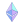

# Getting started

## Installation

```bash
yarn add react-icons-api3
```

## Usage

```jsx
import React from 'react';
import { ChainIcon, SymbolIcon } from 'react-icons-api3';

const App = () => (
    <div>
        <ChainIcon id={'1'} width={50} height={50} />
        <SymbolIcon id={'BTC'} width={50} height={50} />
    </div>
);

export default App;
```

## API

### ChainIcon

| Prop | Type   | Default | Description |
| ---- | ------ | ------- | ----------- |
| id   | string |         | Chain id    |

### SymbolIcon

| Prop | Type   | Default | Description |
| ---- | ------ | ------- | ----------- |
| id   | string |         | Symbol id   |

## Supported chains

| Icon                                                      | Chain                    | id         |
| --------------------------------------------------------- | ------------------------ | ---------- |
|      | Arbitrum testnet         | 421613     |
|       | Arbitrum Nova            | 42170      |
|       | Arbitrum One             | 42161      |
|  | Aurora testnet           | 1313161555 |
|  | Aurora                   | 1313161554 |
|       | Avalanche testnet        | 43113      |
|       | Avalanche                | 43114      |
|       | Base Goerli testnet      | 84531      |
|        | Base                     | 8453       |
|       | Boba/Avalanche           | 43288      |
|       | Boba/BNB                 | 56288      |
|         | Boba/Ethereum            | 288        |
|          | BNB Smart Chain testnet  | 97         |
|          | BNB Smart Chain          | 56         |
|         | Cronos testnet           | 338        |
|           | Ethereum Goerli testnet  | 5          |
|    | Ethereum Sepolia testnet | 11155111   |
|           | Ethereum                 | 1          |
|        | Fantom testnet           | 4002       |
|         | Fantom                   | 250        |
|       | Gnosis Chain testnet     | 10200      |
|         | Gnosis Chain             | 100        |
|       | Godwoken testnet         | 71401      |
|       | Godwoken                 | 71402      |
|        | Kava testnet             | 2221       |
|        | Kava                     | 2222       |
|       | Linea Goerli testnet     | 59140      |
|       | Linea                    | 59144      |
|        | Mantle Goerli testnet    | 5001       |
|        | Mantle                   | 5000       |
|         | Metis testnet            | 599        |
|        | Metis                    | 1088       |
|      | Milkomeda C1 testnet     | 200101     |
|        | Milkomeda C1             | 2001       |
|        | Moonbeam testnet         | 1287       |
|        | Moonbeam                 | 1284       |
|        | Moonriver                | 1285       |
|         | Optimism testnet         | 420        |
|          | Optimism                 | 10         |
|       | Polygon testnet          | 80001      |
|        | Polygon zkEVM testnet    | 1442       |
|        | Polygon zkEVM            | 1101       |
|         | Polygon                  | 137        |
|          | Rootstock testnet        | 31         |
|          | Rootstock                | 30         |
|      | Scroll Goerli testnet    | 534353     |
|         | SX Network testnet       | 647        |
|         | SX Network               | 416        |
|         | zkSync testnet           | 280        |
|         | zkSync                   | 324        |

## License

MIT ©

<!-- prettier-ignore-end -->
